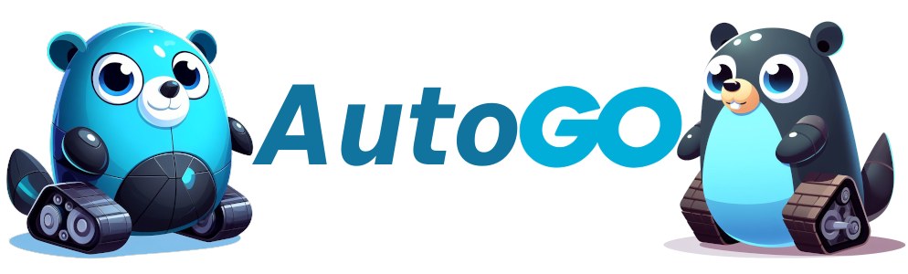

### Raspberry Pi Autonomous Golang 1.16 robot

<!-- 
    Logo image generated by Bing IA: https://www.bing.com/images/create/
-->

__Refactor para Go 1.21 em andamento*__

 

              

 

 

#### 🕸️ Minhas Redes:
     

---

Projeto em desenvolvimento com finalidade de estudo de uso de Golang com Robotica Básica e IOT (libs [Gobot](https://gobot.io/) e [Gocv](https://gocv.io/)), funcional na plataforma base (Raspberry 3b+/4b Rasbpian recente).

Setup:
  1. Em uma plataforma raspberry que siga o esquema autoGo e seus [scripts auxiliares](./scripts/README.md), instalar o [pi-blaster](https://github.com/sarfata/pi-blaster)

  2. Rodar ´sudo raspi-config´ entrar em ´3 Interface Options´ para habilitar a interface de camera ´P1 Camera´ e o barramento ´P5 I2C´

  3. Rodar o comando para alterar pinagem i2c e habilitar todos pins para o gobot: `./autogo.sh`

  4. Gerando Binário com raspberry como device alvo: `GOARM=6 GOARCH=arm GOOS=linux go build main.go`

  5. Rode o Binário. Com um teclado conectado ao raspberry, teclas de seta movimentam o veiculo, teclas "a, w, s, d" movimentam os servos da camera. Stream de video, condução pela web (pagina cliente) e condução autônoma (via sensor de sonar e outros métodos) ainda serão implementados

Esquema autoGo

Setup Client:
  1. Configurar no arquivo .env o MessagerBroker com dados de uma conta MQTT. Broker [hive](https://www.hivemq.com/mqtt-cloud-broker/) gratuito sugerido
   
  2. Rodar `docker build --tag autogo-client-test .` e depois da imagem buildada rodar `docker run autogo-client-test`

  3. Validar mensagens de acordo com os recursos do autogo configurado na mesma fila com as mesmas envs `PROJECT_NAME` e `ROBOT_NAME`. Ter um client configurado no computador de testes é aconselhável, sugestão [mqtt-explorer](http://mqtt-explorer.com/)

Site Cliente e MQTT

Referências:
  - [Pq nao dockerizar o device?](https://ubuntu.com/blog/ros-docker)
  - [:::ROS Golang](https://ubuntu.com/blog/go-for-ros)
  - [Condução Autônoma IA com Intel 1](https://towardsdatascience.com/robot-tank-with-raspberry-pi-and-intel-neural-computer-stick-2-77263ca7a1c7)
  - [Go visão computacional](https://about.sourcegraph.com/go/gophercon-2018-computer-vision-using-go-and-opencv-3/)
  - [Raspberry com Gobot](https://gobot.io/documentation/platforms/raspi/)
  - [GPIO com Golang](https://pkg.go.dev/github.com/heupel/gobot/platforms/gpio#section-readme)
  - [Lib LCD i2c Golang](https://github.com/d2r2/go-hd44780)

-Próximas etapas:
  - ~~Refatoração na estrutura do código~~
  - ~~Condução Autônoma (Sonar set)~~
  - ~~Condução por Fila MQTT (e web Socket)~~
  - ~~Site Cliente para Condução~~
  - Dockerizar o site cliente e suas dependencias
  - Código mais aderente a boas práticas GO (interfaces, linter e demais melhorias)
  - SH e makefile para automatizar dependencias em instalação nova
  - SH update de goversion no raspbian
  - Testes e validação para outros SO, Ubunto Mate (raspberry 4b) e Ubunto Nvidia Jetson :)
  - Implantar ROS::: Golang

Componentes:
  - [Plataforma Rocket-tank](https://www.robocore.net/robotica-robocore/plataforma-robotica-rocket-tank)
  - [Kit de expansão Rocket-tank](https://www.robocore.net/item-mecanico/kit-de-expansao-rocket-tank)
  - [Suporte pan tilt](https://lista.mercadolivre.com.br/suporte-pan-tilt-arduino)
  - [PowerBank minimo 2,5 amperes](https://lista.mercadolivre.com.br/powerbank-mi#D[A:PowerBank%20mi])
  - [Bateria 7,2 V](https://lista.mercadolivre.com.br/bateria-leao-nimh-7.2#D[A:bateria%20leao%20nimh%207.2])
  - [Raspberry py ModelB 3 ou mais recente](https://lista.mercadolivre.com.br/raspberry-py-modelb-3)
  - [Case raspberry com fan](https://lista.mercadolivre.com.br/case-raspberry-pi-cooler-duplo-aluminio_OrderId_PRICE_NoIndex_True)
  - [Raspicam](https://www.robocore.net/acessorios-raspberry-pi/camera-para-raspberry-pi-rev-1-3)
  - [16 ch pwm](https://lista.mercadolivre.com.br/16-ch-pwm)
  - [2x servos motores 9g](https://lista.mercadolivre.com.br/servos-motores-9g#D[A:servos%20motores%209g])
  - [Ponte H l298n](https://lista.mercadolivre.com.br/raspiberry-cam)
  - [Display LCD 16x2 i2c](https://lista.mercadolivre.com.br/display-16x2-i2c#D[A:display%2016x2%20i2c])
  - [4x Sensores Sonar](https://lista.mercadolivre.com.br/arduino-sonar-sensores#D[A:arduino%20sonar%20sensores])
  - [Arduino UNO](https://lista.mercadolivre.com.br/arduino-uno#D[A:Arduino%20UNO])
  - [Mini teclado sem fio](https://lista.mercadolivre.com.br/mini-keyboard#D[A:mini%20keyboard])
  - [Parafusos e porcas M3 20mm e 12mm](https://lista.mercadolivre.com.br/parafusos-e-porcas-m3-20mm#D[A:Parafusos%20e%20porcas%20M3%2020mm])
  - [Conector p4 2.1 mm](https://lista.mercadolivre.com.br/conector-p4-2.1-mm#D[A:conector%20p4%202.1%20mm])
  - [MPU9250](https://lista.mercadolivre.com.br/mpu9250#D[A:MPU9250])
  - MiniProtoboard OU Tubos termo retrateis, Cabos, fita isolante, curiosidade vontade e disposição para nao se frustrar muito no processo (o que não raro, vai acontecer)

Criando novas Issues. A ideia é manter atualizado enquanto avanço em Golang e outros tópicos vinculados interessantes.

Existe uma versão do projeto em Python (Autobot), pretendo andar com ela em paralelo pois Python já possui soluções que serão portadas para o AutoGo.

Um estudo divertido.
Todos estamos tentando melhorar. ;)

